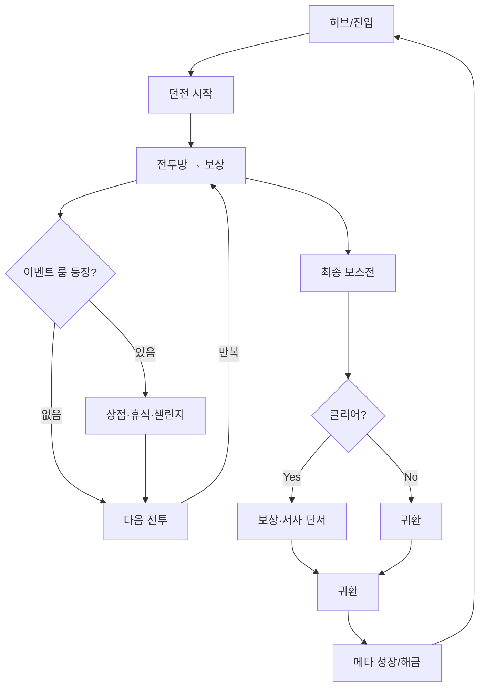

# 02_Specs — Core Loop & Dungeon Loop (직선형 + 이벤트 룸)

> 버전: v0.7 · 목표 런타임: 1런 40~60분 · 구조: 직선형 웨이브 진행 + 전투 사이 이벤트 룸 삽입

---

## 1) Core Pillars (핵심 기둥)

- **스타일리시 전투**: 스위칭/콤보/패링 중심, 빠른 템포 전투
    
- **간결한 진행**: 직선형 구조로 템포 유지
    
- **변주 요소**: 전투 사이 간헐적으로 이벤트 룸(상점/휴식/챌린지/시크릿) 삽입
    
- **점진적 서사 드러남**: 이벤트·보스·이벤트 룸에서 작은 단서 제공
    

---

## 2) 코어 루프 개요 (간단화)

※ 시크릿 룸은 플로우에 직접 포함되지 않고, **방과 방 사이 통로에서 낮은 확률로 은폐된 입구** 형태로 등장.

---

## 3) 던전 루프 (한 던전 내부)

- **구성**: 직선 진행(전투방 8~12개) + 전투 사이 이벤트 룸 삽입 + 낮은 확률의 시크릿 통로
    
- **진행**: 전투 → 보상 → (이벤트 룸 여부) → 다음 전투 → 반복 → 최종 보스
    
- **미니맵**: 직선 라인을 기본으로, 이벤트 룸은 별도 아이콘, 시크릿은 탐색 전 표시되지 않음
    

### 3.1 방 타입 정의

|타입|설명|주요 상호작용|비고|
|---|---|---|---|
|전투방|기본 전투, 입구 봉쇄 후 웨이브/패턴 클리어|보상 지급|템포 60~120초|
|상점|자원으로 아이템·강화·회복 구매|경제 관리|최소 1회 보장|
|휴식|HP 등 자원 회복|회복량/코스트 랜덤|확률 등장|
|챌린지|조건부 룸(무피격, 타임어택 등)|성공 시 상위 보상|실패 시 페널티|
|시크릿|은폐된 입구로 진입, 희귀 보상·서사 단서|발견 자체가 보상|방과 방 사이 통로에서 낮은 확률 생성|
|최종 보스|던전 클라이맥스|클리어 보상 + 서사 단서|던전 종료|

### 3.2 방 락/언락 규칙

- 전투방: 진입 시 **Lock-In**, 적 전멸 시 **Unlock**
    
- 이벤트 룸: 진입 시 즉시 상호작용 가능, 전투 없음 (챌린지 룸 제외)
    
- 시크릿 룸: 탐색 시 은폐된 입구를 발견해야 진입 가능
    
- 보스방: Lock-In 후 페이즈별 전투 진행, 클리어 시 Unlock
    

---

## 4) 이벤트 룸 배치 규칙

- **기본 흐름**: 전투방 1~2개 클리어 후, 일정 확률로 이벤트 룸 등장
    
- **이벤트 룸 종류 배치 확률 (예시 값)**:
    
    - 상점: 20% (던전당 최소 1회 보장)
        
    - 휴식: 20% (체력 관리 밸브 역할)
        
    - 챌린지: 15% (위험/보상 변주 제공)
        
- **시크릿 룸**:
    
    - 전투방과 전투방 사이 **통로 구간**에서 낮은 확률로 생성
        
    - 입구가 가려져 있으며 탐색/파괴/조건 충족으로 발견 가능
        
    - 출현 확률: 약 5%
        
- **연속 배치 제한**: 같은 종류의 이벤트 룸이 연속 2회 이상 등장하지 않음
    
- **스테이지 구간 보정 (예시)**:
    
    - 초반(1~3방): 상점/휴식 확률 가중치↑
        
    - 중반(4~7방): 챌린지 확률↑
        
    - 후반(8방 이후): 보스방 전 회복 방 확률↑, 시크릿 출현 가중치↑