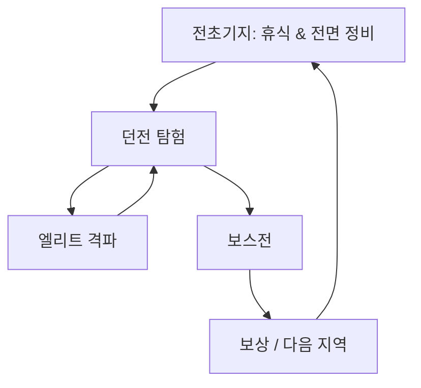

# 3D 탑다운 소울라이크 – 마스터 GDD (v0.5)

> **목적**  
> 이 문서는 게임의 **핵심 규칙·시스템·개발 지침**을 한눈에 보기 좋게 정리하여, 개발·밸런싱·아트·기술 의사결정의 기준점으로 삼는다.  
> *세부 태스크 보드와 스프린트 일정은 별도 문서에서 관리한다.*

---

## 1. 게임 개요

### 1.1 기본 정보

| 항목 | 내용 |
| --- | --- |
| 가칭 | **미정** (베타 전 커뮤니티 피드백으로 확정) |
| 장르 / 시점 | **3D 탑다운 액션 · 소울라이크** |
| 핵심 컨셉 | • 3인 파티 즉시 스왑 • 회피·패링 중심 고밀도 전투 • 슬롯·코스트 기반 **유물 빌드** |
| 플랫폼 | PC(키·마) · 모바일(버추얼 패드) – *세이브 클라우드 공유* |
| 엔진 / 툴 | Unity 6 LTS · TopDown Engine(이동·충돌 코어) |
| 팀 / 기간 | **1인 개발** · 6개월 베타 로드맵 |

### 1.2 지향 경험
1. **패턴 학습** – 보스 패턴 관찰·적응으로 ‘실력 성장’ 체감  
2. **빌드 파고들기** – 45 슬롯 유물 조합으로 ‘내 스타일’ 세팅  
3. **즉흥 전략** – 전투 중 캐릭터 스왑·저스트 회피·패링으로 순간 판단 보상  

---

## 2. 핵심 게임 흐름 (매크로 루프)

## 3. 캐릭터 시스템

### 3.1 파티 편성 & 스왑

- 스테이지 시작 시 **3명** 고정 선택 → 던전 내부 교체 불가
    
- 숫자키 **1/2/3** 즉시 스왑 _(0.25 s 애니, 무적 X)_
    
- 저스트 회피로 획득한 **+2 s 무적**은 스왑 순간 해제 → ‘안전 스왑’ 방지
    

### 3.2 공통 능력치 & 치명타

|♥ HP|⚔ ATK|🛡 DEF|💥 치명타 확률|💢 치명타 피해|✹ 유물 슬롯|
|---|---|---|---|---|---|
|1 000|100|50|**10 %**|**+75 %**|**20 → 45**|

> **치명타 공식** : `최종 DMG = 기본 DMG × (1 + 치명타 피해)` → 초기 크리 = ×1.75

### 3.3 성장 구조

|시스템|재화|설명|
|---|---|---|
|**스킬 트리**|**Echo**|스탯·신규 스킬·유물 슬롯 해금 & 리스펙|
|**유물 강화**|유물 조각|옵션 상승, 코스트 +1 (최대 +3강)|
|**포션 강화**|포션 증강제|회복량·스택·채널 속도 업그레이드|

> _Echo = 위험·보상 / 조각 = 빌드 성장 / 증강제 = 생존 루프_

### 3.5 공통 액션 프레임 데이터

| 액션      | 60fps 기준 프레임            | 핵심 수치                  | 비고               |
| ------- | ----------------------- | ---------------------- | ---------------- |
| 이동      | –                       | 속도 4m/s · 회전 720°/s    | 무제한              |
| 회피 롤    | 48f                     | 5m 이동 · 전 프레임 무적       | 쿨 2.5s           |
| 저스트 회피  | 히트 ±12f                 | 추가 무적 2s · ATK+20%     | 스왑 시 해제          |
| 약공격 3콤보 | 24f/24f/30f             | 80·90·110% ATK         | 60f 미입력 시 리셋     |
| 강공/패링   | 선딜 24f · 패링 6f · 후딜 36f | 150% ATK               | RMB 탭=패링, 홀드=강공  |
| 패링 성공   | –                       | 적 1s 스태거 · 투사체 120% 반사 | 보스 가능(텔레그래프)     |
| 플라스크    | 120f                    | HP 100% /3틱            | Space 캔슬 시 부분 회복 |
> **프레임/데미지 개별화** : 위 표의 수치는 **기본값**이며, 각 캐릭터별로 애니메이션 길이·공격 배수·패링 윈도우가 달라질 수 있다. 상세 데이터는 개별 캐릭터 시트에서 관리.
> **애니메이터 참고** : 30fps 기기에서도 무적 프레임 수치를 TimeScale로 고정 유지.

### 3.5 캐릭터 예시

- **블레이드 런너** – 이동 특화, _돌진 베기_ (쿨 12 s)
    
- **듀얼 피스트** – 중거리 탄막, _난사 모드_ (쿨 18 s)
    
- **스벨트 가드** – 방어 보조, _파동 방벽_ (쿨 15 s)
    

---

## 4. 전투 메커닉

### 4.1 입력 (PC)

| Key       | Action | 핵심 수치                |
| --------- | ------ | -------------------- |
| WASD      | 이동     | –                    |
| **Space** | 회피     | 0.8 s 무적 · CD 2.5 s  |
| **LMB**   | 콤보 공격  | 총 1.2 s              |
| **RMB**   | 강공/패링  | 선딜 0.4 s · 패링창 0.1 s |
| **E**     | 액티브 스킬 | 10–25 s CD           |
| **Q**     | 플라스크   | 2 s 채널 · 캔슬 시 부분 회복  |

### 4.2 핵심 규칙

1. **패링 성공** → 1 s 스태거 + 투사체 120 % 반사
    
2. **저스트 회피 0.2 s** → +2 s 무적 & +20 % ATK 버프
    
3. **스왑 버프별 유지** – 쿨/버프는 캐릭터 단위 관리
    

---

## 5. 자원 & 경제

|자원|획득|사망 페널티|사용처|
|---|---|---|---|
|**Echo**|몬스터·보스·상자|시체 드롭|스킬 트리·리스펙|
|**유물 조각**|엘리트·보스·분해|유지|유물 강화|
|**포션 증강제**|탐색 보상|유지|플라스크 업그레이드|

> **메모**: Echo 손실로 긴장감, 조각·증강제 보존으로 빌드 진행 유지

---

## 6. 유물 시스템

- **슬롯/코스트** 퍼즐
    
- **강화** : 조각 소비 → 효과↑, 코스트 +1 (최대 +3)
    
- **희귀도** : Common → Rare → Epic → Legendary (<1 %)
    

> _예시 빌드_  
> _날카로운 칼날_(2)×3 → ATK +30 %  
> _운명의 주사위_(6)+_섀도우 스텝_(4) → 크리+회피 세팅

---

## 7. 플라스크

- 기본 3스택 · HP 100 % 회복(3틱) · 채널 2 s
    
- 업그레이드 5단: 스택 → 회복량 → 채널 단축
    

---

## 8. 레벨 & 전초기지

### 8.1 던전 프레임워크

|항목|목표치|
|---|---|
|레이아웃|**가지형** + 2–4 사이드|
|소요|1–4 h|
|Outpost 간격|30–45 min|
|보스|2페이즈 · 6–8 패턴 · 5–10 트|

### 8.2 **Outpost Camp** (세이브/정비 허브)

|기능|설명|
|---|---|
|휴식|HP·플라스크 회복 → 몬스터 리스폰|
|파티 편성|캐릭터 3명 재배치|
|스킬 트리|Echo로 노드 해금·무료 리스펙|
|유물 단조|강화·분해·프리셋|
|플라스크 작업대|증강제 소비 업그레이드|
|NPC 상점|소비품, 희귀 유물 판매|
|훈련 더미|패턴·DPS 연습|
|파스트래블|해금 Outpost 간 이동|

---

## 9. 보스 가이드

1. 근접/원거리/광역 + 패링 패턴 포함
    
2. HP 50 %·30 % 페이즈 전환
    
3. 30 % 이하 ‘패링 불가’ 엔레이지
    
4. 목표: dev 3트 · 신규 8트
    

---

## 10. UI·UX

- 좌 HP·플라스크, 우 스킬 CD, 크리 이펙트
    
- 첫 행동 툴팁(ESC 끄기)
    
- 유물 그리드 + 코스트 게이지
    

---

## 11. 기술 사양

|항목|목표|
|---|---|
|카메라|40° 탑다운 · 부드러운 팔로우 · 락온|
|성능|PC 60fps@1080p · 모바일 30fps|
|세이브|JSON 슬롯 · 클라우드|
|입력|Unity New Input|

---

## 12. 6개월 로드맵

|월|마일스톤|
|---|---|
|M1|전투 프로토 · 더미 보스|
|M2|유물 MVP · Outpost 루프 · 던전 1 그레이박스|
|M3|3캐릭터 · Outpost UI · 플라스크 시스템|
|M4|던전 2 + 보스 2 · HUD 폴리싱|
|M5|밸런스 · 모바일 컨트롤 · QA|
|M6|베타 빌드 · 외부 피드백 반영|

---

## 13. 용어

- **Echo** – 경험치·화폐, 사망 시 드롭
    
- **Relic** – 슬롯/코스트 패시브 아이템
    
- **Just Dodge** – 0.2 s 완벽 회피 → 무적·버프